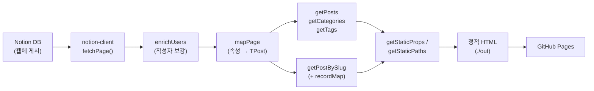
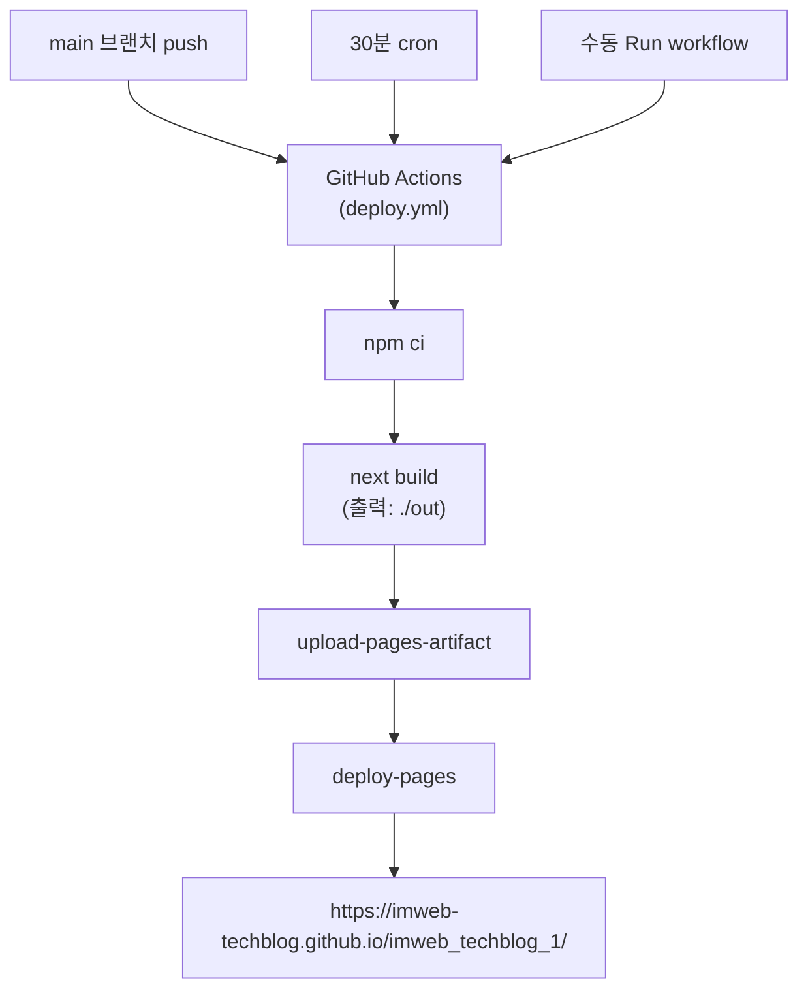

# 아임웹 테크 — 프로젝트 구조

> 새로 합류한 개발자/기획자가 5분 안에 파악할 수 있도록 작성된 구조 안내서.
>
> 다른 문서: [REQUIREMENTS.md](./REQUIREMENTS.md) (요구사항) / [DEPLOY.md](./DEPLOY.md) (운영) / [README.md](./README.md) (개요)

---

## 1. 한 줄 요약

**노션 DB → notion-client 로 fetch → Next.js 가 정적 HTML 생성 → GitHub Pages 호스팅**

토큰 없는 비공식 API 를 사용하므로 노션 DB 가 "Publish to web" 되어 있어야 합니다.

---

## 2. 기술 스택

| 영역 | 기술 |
|---|---|
| Framework | **Next.js 14** (`output: "export"` 로 정적 export) |
| 언어 | TypeScript + React 18 |
| 스타일 | Tailwind CSS + 커스텀 CSS 토큰 (`globals.css`) |
| 폰트 | Pretendard (한글) |
| 데이터 | **notion-client** (비공식 Notion API) |
| 본문 렌더 | **react-notion-x** + Prism (코드) + KaTeX (수식) |
| 댓글 | **giscus** (GitHub Discussions) |
| 호스팅 | GitHub Pages + GitHub Actions |

---

## 3. 디렉터리 구조

```
imweb_techblog_1/
├── public/
│   ├── banner.webp                  메인 상단 슬로건 배너
│   ├── symbol.webp                  로고 (헤더, favicon)
│   ├── og-default.png               OG 기본 이미지
│   ├── robots.txt
│   ├── .nojekyll                    GitHub Pages 가 Jekyll 처리 건너뛰게
│   └── post-images/                 노션 thumbnail 직접 호스팅 (attachment 우회)
│
├── src/
│   ├── components/
│   │   ├── home/
│   │   │   ├── Banner.tsx           메인 상단 고정 배너
│   │   │   ├── Sidebar.tsx          카테고리/태그 필터 (lg+ sticky 좌측, < lg 토글)
│   │   │   ├── PostGrid.tsx         글 목록 + 그리드/리스트 뷰 토글
│   │   │   ├── PostCard.tsx           ↳ 그리드 뷰의 카드
│   │   │   └── PostListItem.tsx       ↳ 리스트 뷰의 행
│   │   ├── layout/
│   │   │   ├── Header.tsx           로고 + 네비 + 검색 input
│   │   │   ├── Footer.tsx           메뉴 + 회사 정보 + 저작권
│   │   │   └── Layout.tsx           페이지 wrapper
│   │   └── post/
│   │       ├── PostHeader.tsx       제목·메타·태그·커버
│   │       ├── PostContent.tsx      <NotionRenderer /> 래핑
│   │       ├── PostActions.tsx      공유 버튼
│   │       └── Comments.tsx         giscus 임베드
│   │
│   ├── lib/
│   │   ├── notion/
│   │   │   ├── client.ts            NotionAPI 인스턴스 (내부), fetchPage / fetchUsers 헬퍼
│   │   │   ├── getPosts.ts          DB → TPost[] (목록, 카테고리/태그 집계)
│   │   │   ├── getPostBySlug.ts     단일 글 → TPost + recordMap
│   │   │   ├── mapPage.ts           notion block → TPost 매핑 (속성 파싱)
│   │   │   └── enrichUsers.ts       공개 페이지의 빈 notion_user 보강
│   │   └── utils/
│   │       ├── formatDate.ts        "2026-05-13" → "2026.05.13"
│   │       ├── slugify.ts           제목 → URL slug
│   │       ├── safeStatic.ts        getStaticProps try/catch + fallback 헬퍼
│   │       └── withBasePath.ts      GitHub Pages basePath 자동 prefix
│   │
│   ├── pages/
│   │   ├── _app.tsx                 전역 CSS, OG meta
│   │   ├── _document.tsx
│   │   ├── 404.tsx
│   │   ├── index.tsx                메인 (홈)
│   │   ├── about.tsx                소개
│   │   ├── search.tsx               검색 결과 (?q=...)
│   │   ├── tags.tsx                 태그 목록
│   │   └── posts/[slug].tsx         글 상세
│   │
│   ├── styles/globals.css           Tailwind base + .prose-body / .lift-card / .chip
│   └── types/index.ts               TPost / TAuthor / TPostStatus
│
├── .github/workflows/deploy.yml     CI: build + Pages 배포
├── next.config.js                   output: "export", basePath, image config
├── tailwind.config.js               컬러/타이포/easing 토큰
├── tsconfig.json
├── package.json
└── site.config.js                   ★ 운영 설정 (블로그명/메뉴/회사정보/giscus)
```

> **운영 중 자주 만지는 파일은 굵게 표시한 `site.config.js` 하나입니다.**

---

## 4. URL / 페이지 구조

| 경로 | 파일 | 설명 |
|---|---|---|
| `/` | `pages/index.tsx` | 메인. 배너 + 사이드바(필터) + 전체 글 목록 |
| `/posts/<slug>/` | `pages/posts/[slug].tsx` | 글 상세. 헤더 + 본문 + 공유 + 댓글 |
| `/tags/` | `pages/tags.tsx` | 모든 태그를 칩으로 나열 |
| `/search/?q=...` | `pages/search.tsx` | 클라이언트 사이드 substring 검색 |
| `/about/` | `pages/about.tsx` | 소개 |
| `/404` | `pages/404.tsx` | Not Found |

외부 링크 (네비):
- 채용 → https://career.imweb.me
- 개발자센터 → https://developers.imweb.me

---

## 5. 데이터 흐름



**핵심 포인트**
- `notion-client` 호출은 build-time + dev request 시점에 일어남 (런타임 X)
- 일시적 502/네트워크 에러는 retry 3회 자동 재시도 후, 영구 실패 시 `safeAsync()` 로 빈 상태 UI (`잠시만 기다려주세요.`) graceful fallback
- 공개 게시된 페이지에는 `notion_user` 가 비어있어 `enrichUsers` 가 별도 fetch 로 채워줌

---

## 6. 컴포넌트 트리

### 홈 (`/`)

```
Layout
├── Header                  로고 / 네비 / 검색 input
├── HomePage
│   ├── Banner              상단 슬로건 이미지
│   ├── Sidebar             카테고리 / 태그 필터
│   │   ├── DesktopFilters  (lg+) sticky 좌측 vertical 리스트
│   │   └── NarrowFilters   (< lg) 토글 + 2컬럼 칩
│   └── PostGrid            글 목록
│       ├── ViewToggle      그리드/리스트 토글 버튼
│       ├── PostCard*       (grid 모드)
│       └── PostListItem*   (list 모드, 기본)
└── Footer
```

### 글 상세 (`/posts/<slug>/`)

```
Layout
├── Header
├── PostHeader              카테고리 라벨 / 제목 / 요약 / 작성자·날짜 / 태그 칩 / 커버
├── PostContent             <NotionRenderer /> + dynamic Code/Collection/Equation/Modal
├── PostActions             공유 버튼 (Web Share API + clipboard fallback)
├── Comments                giscus (활성 시)
└── Footer
```

---

## 7. 노션 데이터베이스 스키마

| 속성 | 타입 | 필수 | 비고 |
|---|---|---|---|
| `title` | Title | ✅ | 글 제목 |
| `slug` | Text | 권장 | URL 의 일부. 영문 소문자 + 하이픈 |
| `status` | Select | ✅ | `Public` 만 노출. `PublicOnDetail` 등은 빌드 제외 |
| `category` | Select | 권장 | 사이드바 카테고리 (옵션 정의 순서 유지) |
| `tags` | Multi-select | 선택 | 사이드바 태그 |
| `summary` | Text | 권장 | 카드/메타 description |
| `date` | Date | 권장 | 발행일 (정렬 키) |
| `thumbnail` | File | 선택 | 카드 썸네일. 노션 신형 attachment 는 미노출 — `public/post-images/` 권장 |
| `author` | Person | 선택 | 카드/상세에 표시 |

---

## 8. 빌드 / 배포 파이프라인



**트리거**
- `push: branches: [main]`
- `schedule: cron "*/30 * * * *"` — 30분마다 (노션 변경 자동 반영)
- `workflow_dispatch` — Actions 탭에서 수동

---

## 9. 디자인 시스템 (간단)

### 컬러 / 토큰 (`globals.css`)

| 토큰 | 값 | 용도 |
|---|---|---|
| `--color-brand` | `#3182F6` | 포커스 / 강조 |
| `--color-text` | `#191F28` | 본문 |
| `--color-subtext` | `#4E5968` | 보조 |
| `--color-surface` | `#F9FAFB` | 카드/칩 배경 |
| `--color-border` | `#E5E8EB` | 구분선 |
| `--ease-smooth` | `cubic-bezier(0.16, 1, 0.3, 1)` | hover/transition |

### 재사용 클래스

| 클래스 | 사용처 |
|---|---|
| `.prose-body` | 글 본문 (h1~h4, p, code, blockquote 등) |
| `.lift-card` | 카드 hover 시 그림자 + Y -4px |
| `.chip` | 태그/카테고리 칩 (`.is-active` 로 활성) |
| `.no-scrollbar` | 가로 스크롤 영역의 스크롤바 숨김 |

### 반응형 브레이크포인트

| 폭 | 적용 |
|---|---|
| `< 640px` | 카드 1열, 검색 input 숨김, 사이드바 토글 |
| `640~1024px` | 카드 2열, 사이드바 토글 (펼치면 2컬럼) |
| `≥ 1024px` | 좌측 사이드바 (220px) + 본문, 카드 3열 |

---

## 10. 핵심 설정 파일 요약

| 파일 | 책임 |
|---|---|
| **`site.config.js`** | 블로그명, 설명, 네비, 회사 정보, 노션 DB ID, giscus 설정 |
| `next.config.js` | basePath (GitHub Pages), 정적 export, image unoptimized |
| `tailwind.config.js` | 컬러/타이포/이징 토큰 → Tailwind 유틸로 노출 |
| `.github/workflows/deploy.yml` | 빌드 + Pages 배포 (push / cron / 수동) |

---

## 11. 알려진 한계 / 자주 묻는 항목

| | 한계 | 우회 |
|---|---|---|
| 1 | 노션 신형 attachment 이미지 (`attachment:...`) 가 비공식 API 로 안 풀림 | `public/post-images/` 직접 호스팅 + 노션 thumbnail 에 GitHub Pages URL 임베드 |
| 2 | 검색이 본문은 포함하지 않음 | 제목/요약/카테고리/태그 substring 만 |
| 3 | dev 의 `getStaticPaths` 캐시 | 노션에 새 글 추가 후 dev 서버 재시작 |
| 4 | 글 50건 초과 시 일부 누락 가능성 | `getPosts` 페이지네이션 보강 (TODO) |
| 5 | sitemap.xml / RSS 미제공 | (TODO) |
