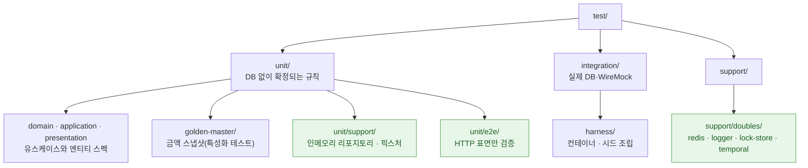

# 목 2,199개를 4개로 줄이기까지: 목을 쓸 수 없는 구조 만들기

여러분이 지금 보고 있는 코드베이스에는 목(mock) 객체가 몇 개쯤 있을까요?

맡은 어필리에이트 백엔드 3개 앱에는 1,336개가 있었습니다. 두 달 뒤에는 2,199개가 됐습니다. 줄인 게 아니라 늘린 숫자입니다. 그리고 다시 한 달이 안 돼 4개가 됐습니다. 남은 4개는 HTTP 표면만 검증하는 e2e(end-to-end) 스펙 두 곳에 몰려 있습니다.

목을 지우는 일인 줄 알았는데, 해보니 목이 필요 없는 구조를 만드는 일이었습니다. 그 과정에서 통합 테스트 6개가 모두 통과하는 바람에 가려져 있던 정산 버그도 하나 나왔습니다.

통합 테스트, 특성화 테스트, lint 순으로 쌓아 올린 두 달 반의 기록입니다.

## 시작점: 통합 테스트 0개, 목 1,336개

입사 첫날 어필리에이트 TypeScript 3개 앱(platform, platform-jobs, imcreators)의 테스트 현황은 이랬습니다.

| 항목 | 2026-05-08 |
| --- | --- |
| 스펙 파일 | 140개 |
| 통합 테스트 | 0개 |
| `src/` 안에 소스와 동거하는 스펙 | 140개 |
| `vi.fn(` 사용 | 약 1,336개 |

> 측정 기준: 스펙 파일 수는 git 리비전별 `git ls-tree` 집계, 목 개수는 같은 리비전에서 `vi.fn(` 출현 수를 정규식으로 센 값입니다. 정규식 기반이라 이 글의 목 개수는 모두 근삿값입니다.

스펙 하나당 목이 평균 10개꼴입니다. 처음엔 테스트를 급하게 짰나 보다 정도로 읽었는데, 급하게 짰다고만 보면 원인을 놓칩니다. **통합 테스트가 0개였다는 사실이 먼저였습니다.** DB에 무엇이 저장됐는지 확인할 방법이 없으면, 검증할 수 있는 건 리포지토리의 어떤 메서드를 어떤 인자로 불렀는가뿐입니다. 목은 누군가 대충 한 게 아니라 그때 가능했던 유일한 방법이었습니다.

### AI가 부추기는 관성

그런데 이 숫자를 줄이기 시작한 건 한참 뒤의 일입니다. 입사하고 두 달 동안은 오히려 목을 더 만들었습니다. 6월 말에 2,199개로 정점을 찍었는데, 그 구간에서 올린 테스트 커밋 246건 중 216건이 AI와 함께 작성한 것이었습니다. 입사 이전의 스펙 커밋 100건에는 AI 공저 표기가 하나도 없었습니다. 목을 쌓은 건 사람 손이었지만, 속도를 붙인 쪽은 저였습니다.

AI 코딩 에이전트에게 이 서비스 테스트를 짜 달라고 하면 거의 예외 없이 목으로 짭니다. 왜 그럴까요? 네 가지 이유가 있다고 봅니다.

**첫째, 목은 파일 하나만 알면 만들 수 있습니다.** 실제 DB 위에서 검증하려면 테스트 환경, 스키마, 시드 빌더, 격리 전략을 알아야 합니다. 코드베이스 전체를 아는 지식이죠. 반면 목은 테스트 대상의 생성자 시그니처만 보면 즉시 만들어집니다. 한 번에 읽을 수 있는 양이 정해진 에이전트에게 목은 가장 싼 경로입니다.

**둘째, 테스트 통과가 곧 완료 신호입니다.** 에이전트는 테스트가 통과했다를 작업 종료 조건으로 삼습니다. 목으로 짠 테스트는 느리지 않고, 환경에 의존하지 않고, 간헐적으로 실패하지도 않습니다. 통과를 가장 확실하게 보장하는 방법이 목입니다. 문제는 그 통과가 무엇을 증명하는지까지는 종료 조건에 들어 있지 않습니다.

**셋째, 에이전트는 옆 파일을 모방합니다.** 이 세 번째가 가장 강력합니다. 목이 1,336개 있는 코드베이스에서 새 테스트를 요청받으면, 에이전트는 그 관례를 따르는 것이 옳다고 판단합니다. 대체로 맞는 판단이기도 합니다. 결과적으로 목이 많은 코드베이스는 AI를 쓸수록 목이 더 빨리 늘어납니다. 자기강화 루프입니다.

**넷째, 학습된 기본값 자체가 목입니다.** 테스트 튜토리얼과 프레임워크 문서의 지배적 형태가 목 기반 유닛 테스트입니다. 별도 지시가 없으면 그 형태로 수렴합니다.

이 네 가지가 겹치면 결론은 하나로 모입니다. **`AGENTS.md`에 목을 쓰지 말라고 적는 것으로는 막을 수 없습니다.** 다음 세션의 에이전트는 그 문장을 읽고도 옆 파일에서 목을 보고, 목이 이 코드베이스의 관례라고 판단합니다. 자연어 지시는 관성을 이기지 못했습니다.

그래서 이 글의 결론은 목을 쓰지 말자가 아니라 **목을 쓸 수 없게 만들자**입니다. 뒤에서 다룰 lint 규칙과 포트 분리는 전부 그 목적을 위한 장치입니다.

## 목이 정당한 두 자리

목이 나쁘다는 이야기를 하려는 건 아닙니다. 다만 목이 값을 하는 자리는 생각보다 좁습니다. 저희가 세운 기준은 질문 하나입니다. **내가 고칠 수 있는 코드인가?**

**소유하지 않은 것에는 목을 씁니다.** 결제사 API, 메시지 발송, S3처럼 프로세스 밖에 있는 경계입니다. 테스트에서 진짜로 호출할 수도 없고 호출해서도 안 됩니다. 남의 서버에 실제로 문자를 보내면서 테스트할 수는 없으니까요.

**재현할 수 없는 상황에도 목을 씁니다.** Redis가 죽었을 때 우리 코드가 어떻게 구는지는 실물 컨테이너로 만들기 어렵습니다. 컨테이너를 일부러 죽이는 것보다 명령이 항상 실패하는 Redis를 하나 두는 쪽이 정확하고 빠릅니다.

**소유한 것에는 실물을 씁니다.** 우리가 고칠 수 있는 리포지토리, 도메인 서비스, 유틸입니다. 이건 목으로 세울 게 아니라 진짜를 그대로 쓰거나 인메모리 구현을 만들어 씁니다. 저장 결과를 봐야 한다면 실제 DB 위 통합 테스트로 내립니다.

이 글에서 문제 삼는 건 마지막 경우, 그러니까 우리가 고칠 수 있는 내부 의존 객체를 목으로 세우는 일입니다. 앞으로 그냥 목이라고만 쓰면 이 경우를 가리키고, 뒤에 나올 정당한 두 자리는 외부 경계의 목처럼 밝혀 쓰겠습니다. 참고로 목·스텁·페이크는 엄밀히 구분하지 않고, 실물 대신 세우는 것을 통틀어 목이라고 부르겠습니다.

하나 더 있습니다. **목이 많이 필요하다는 건 대체로 설계 신호입니다.** 의존 객체가 너무 많거나 경계가 잘못 그어져 있다는 뜻입니다. 저희 코드베이스가 정확히 그랬습니다.

## 목을 세운 두 가지 대가

첫째, 동작을 바꾸지 않은 변경에도 테스트가 깨집니다. 6월의 어느 커밋 메시지를 그대로 가져와 봤습니다.

> `listBrands`가 `feeResolverService.resolveBrandPlatformFeeMap`을 호출하는데 "브랜드 목록을 매핑한다" 테스트는 6번째 인자를 `{}`로 넘겨 "is not a function"으로 실패했다. 호출이 추가됐으나 해당 spec mock이 따라오지 않은 케이스.

브랜드 목록 매핑이라는 검증 대상은 그대로인데, 의존 객체가 하나 늘었다는 이유만으로 테스트가 실패한 겁니다. 고치는 방법은 목을 하나 더 세우는 것이었고, 같은 날 같은 유형의 커밋이 세 개 있었습니다. 목이 목을 부릅니다.

둘째, 리팩토링을 테스트가 붙잡습니다. 가장 극단적인 사례는 주문 생성 유스케이스의 1,469줄짜리 스펙이었습니다. 서비스에 흩어져 있던 쿼리를 리포지토리로 옮겼더니 테스트가 따라오지 못했고, 결국 스펙 안에 옛 구조를 되살리는 어댑터 레이어가 생겼습니다.

```tsx
// 서비스 시절 목 표면(findBy/existsBy/findOne/manager.getRepository)을 새 리포지토리 API로 어댑트해
// 기존 시나리오(호출 순서·mockResolvedValueOnce 체인·저장 순서)를 그대로 관통 검증한다.
const createUseCase = (dataSource, manager, userLinkRepository, /* … 11개 파라미터 */) =>
  new CreateOmsOrderUseCase(
    dataSource as never,
    { findByLinkCodes: (codes) => userLinkRepository.findBy({ userLinkCode: codes }) } as never,
    // …
  );
```

프로덕션 코드는 앞으로 갔는데 테스트가 뒤를 붙들고 있는 상태입니다. 목 기반 테스트가 리팩토링을 막는다는 말은 추상론이 아니라 이 파일의 모양 그 자체였습니다.

두 증상은 하나로 정리됩니다. **목을 세우면 검증 대상이 무엇이 저장되고 계산되는가에서 어떤 메서드를 어떤 인자로 불렀는가로 바뀝니다.** 그래서 동작을 바꾸지 않는 리팩토링에도 테스트가 깨지고, 정작 조회 조건이나 저장 조건이 틀려도 통과합니다. 막아야 할 것은 그냥 지나가게 두고, 막지 말아야 할 것을 막습니다.

여기까지가 증상입니다. 원인은 네 번째 결정에서 다시 꺼내겠습니다. 짐작하시는 것보다 조금 더 아래에 있었습니다.

## 첫 번째 결정: 테스트를 고치기 전에 선택지를 만들기

목을 지우려면 목 없이 검증할 자리가 먼저 있어야 합니다. 그래서 5월에 처음 한 일은 테스트 작성이 아니라 Testcontainers와 WireMock으로 통합 테스트 환경을 만드는 것이었습니다. MySQL 컨테이너를 띄워 운영 엔티티로 스키마를 만들고, 외부 HTTP는 WireMock으로 세우고, 유닛과 통합을 별도 러너로 분리했습니다.

앞에서 세운 기준을 이제 실행 가능한 갈래로 옮길 수 있게 됐습니다.

- 저장·조회 결과를 봐야 하는 것: 실제 DB 위의 통합 테스트
- DB 없이 확정할 수 있는 규칙: 유닛 테스트
- 프로세스 밖 경계(HTTP·Redis·S3·Temporal): 목을 두되 나간 값을 기록하게

특히 세 번째, 프로세스 밖 경계가 중요합니다. 목을 두더라도 단언은 호출했다가 아니라 **무엇이 나갔다**로 씁니다. 알림 라우팅 스펙을 예로 들겠습니다. 같은 파일의 Before/After입니다.

```tsx
// Before — 목. "sendSms 가 한 번 불렸다"
const services = {
  smsService: { sendSms: vi.fn().mockResolvedValue(undefined) },
  alimtalkService: { send: vi.fn().mockResolvedValue(undefined) },
};
it('channel="LMS"는 smsService.sendSms로 라우팅한다', async () => {
  await handler.handleNotification({ channel: 'LMS', receiver: '01012345678', message: '본문' });
  expect(services.smsService.sendSms).toHaveBeenCalledTimes(1);
});
```

이 단언은 `sendSms`라는 메서드 이름과 호출 횟수에 묶여 있습니다. 발송 어댑터를 갈아 끼우면서 메서드 이름이 바뀌면 동작이 그대로여도 깨집니다. 반대로 LMS로 보내야 할 메시지가 SMS로 나가도 이 테스트는 통과합니다. **정작 무엇이 나갔는지는 아무도 안 보고 있으니까요.**

```tsx
// After — 기록형 목. "무엇이 나갔다"
class RecordingSmsTransport {
  public readonly sent: Record<string, unknown>[] = [];
  sendSms = async (payload: Record<string, unknown>) => {
    this.sent.push(payload);
    return { result_code: 1 };
  };
}
it('채널을 메시지 종류로 실어 보낸다', async () => {
  const { handler, sms } = buildHandler();
  await handler.handleNotification(smsMessage({ channel: 'LMS', sender: '028888', title: '제목' }));
  expect(sms.sent[0]).toMatchObject({ receiver: '01012345678', message: '내용', messageType: 'LMS', title: '제목' });
});
```

목이 하는 일은 보낸 척하면서 페이로드를 쌓아 두는 것뿐입니다. 단언은 쌓인 값을 봅니다. 이제 라우팅을 어떻게 구현하든, 메서드 이름을 무엇으로 바꾸든 테스트는 그대로 통과하고, `messageType`이 틀리는 순간 실패합니다. 전자는 구현에 묶이고 후자는 계약에 묶이는 차이입니다.

테스트 이름도 같이 바뀌었습니다. `channel="LMS"는 smsService.sendSms로 라우팅한다`에는 의존 객체의 메서드 이름이 들어 있습니다. 목으로 짜면 테스트 이름까지 구현을 따라갔습니다.

## 두 번째 결정: 지우기 전에 잠그기

7월 초, 100개가 넘는 유스케이스를 목 기반 유닛에서 실제 DB 위 통합 테스트로 옮기기로 했습니다. 금액을 다루는 코드가 섞여 있어서 순서를 지켰습니다.

**먼저 특성화 테스트(characterization test)를 만들었습니다.** 코드가 무엇을 해야 하는지가 아니라 지금 실제로 무엇을 하고 있는지를 그대로 기록하는 테스트입니다. 정산 계산, 수수료, 브랜드 인보이스의 현재 출력값을 스냅샷으로 박제했습니다.

> 부가세가 붙는 경로와 안 붙는 경로는 의도된 별개 규칙이므로 각 경로의 현재 값을 그대로 잠근다. 스냅샷이 깨지면 금액이 바뀐 것이므로 회귀로 간주한다.

리팩토링으로 금액이 1원이라도 바뀌면 곧바로 실패하는 테스트를 먼저 두고, 그다음에 코드를 건드렸습니다. 참고로 저희 코드베이스에서는 이 테스트들을 `test/unit/golden-master` 아래에 모아 둡니다. 골든 마스터 테스트라고도 부르는데, 이 글에서는 특성화 테스트로 통일하겠습니다.

**그다음 lint를 통과 상태로 만들었습니다.** 당시 platform의 eslint는 에러 860여 건으로 항상 실패하고 있었습니다. 게이트가 이미 실패하고 있다면 새 규칙을 추가해도 아무것도 막지 못합니다. 테스트 코드의 lint 부채 777건을 먼저 소거하고 CI 게이트를 걸었습니다.

**마지막으로 이관하고 삭제했습니다.** 삭제 기준은 통합으로 옮겼으니 지운다가 아니라 **통합이 유닛의 상위집합임을 확인했으니 지운다**였습니다. 실제로 삭제 전에 커버리지 갭 두 건을 통합 쪽에 보강했고, 실물로 대체할 수 없는 커버리지를 가진 스펙은 남겼습니다.

> 유지(real-DB 대체 불가한 고유 커버리지): create/update-exhibition(외부 LMS·imcreators fanout), product-seeding(승인·거절 SMS 큐잉), create-oms-order(귀속 우선순위), encrypt-pii(암호화 왕복)

## 세 번째 결정: 사람도 AI도 어길 수 없게 만들기

7월 하순에 내부 의존 객체를 세우는 목을 전량 걷어내면서, 같은 일이 반복되지 않도록 규칙을 커스텀 eslint 룰로 만들었습니다. 컨벤션 문서는 지켜지지 않지만 lint는 머지를 막으니까요.

```jsx
// apps/affiliate/platform/eslint-rules.js — 본문 외 부분은 생략했습니다.
const MOCK_APIS = new Set(['fn', 'mock', 'doMock', 'hoisted', 'spyOn', 'mocked']);
// 목을 정의해도 되는 자리. 통합 테스트는 협력자를 실제로 조립하므로 여기 없다.
// e2e 가 여기 있는 이유: 검증 대상이 HTTP 계층 자체(라우팅·가드·ValidationPipe·직렬화)이고
// 그 아래 애플리케이션 계층은 의도적으로 범위 밖이다. 다만 "무엇이 저장/계산되는가"는
// 여기서 단언하지 않는다 — 그건 통합 테스트의 몫이다.
const DEFAULT_MOCK_ALLOWED_DIRS = ['/test/support/doubles/', '/test/unit/support/', '/test/unit/e2e/'];
const noInternalCollaboratorMock = {
  meta: {
    // …
    messages: {
      forbidden:
        "spec 에서 'vi.{{api}}' 로 협력자를 목으로 세우지 않는다. 저장된 값을 봐야 하면 통합 테스트로 내리고, " +
        "계산 결과만 보면 in-memory fake 를 쓴다. 외부 경계(HTTP·Redis·S3·Temporal)의 목이라면 " +
        "{{dirs}} 의 공용 함수로 만들어 쓴다.",
    },
  },
  create(context) {
    if (!context.filename.endsWith('.spec.ts')) return {};              // spec 만 본다
    if (allowedDirs.some((dir) => normalized.includes(dir))) return {}; // 화이트리스트는 통과
    return {
      'CallExpression > MemberExpression[object.name="vi"]'(node) {     // vi.* 를 잡아
        if (!MOCK_APIS.has(api)) return;                                // 목 API 만 걸러낸다
        context.report({ node, messageId: 'forbidden', data: { api, dirs } });
      },
    };
  },
};
```

에러 메시지에 무엇을 하지 마라가 아니라 **대신 무엇을 하라**를 넣었습니다. 이건 사람보다 에이전트에게 더 중요했습니다. 규칙에 걸린 다음 행동이 메시지 안에 있으면, 에이전트는 목을 하나 더 세우는 대신 통합 테스트로 내려갑니다.

막는 것만큼 중요한 건 예외를 좁히는 일이었습니다. 화이트리스트에 적힌 세 경로가 무엇인지 보면 규칙의 모양이 드러납니다. platform 기준 테스트 배치입니다.



초록으로 칠한 세 곳이 목을 세워도 되는 자리입니다. `support/doubles/`는 프로세스 밖 경계, `unit/support/`는 포트를 상속한 인메모리 구현과 픽스처, `unit/e2e/`는 HTTP 표면 자체를 보는 자리입니다.

**통합 테스트 디렉터리는 화이트리스트에 없습니다.** 의존 객체를 실제로 조립하는 곳이라 목이 필요할 이유가 없습니다. `unit/e2e/`가 왜 예외인지는 마지막에 다시 이야기하겠습니다.

## 네 번째 결정: 목 아닌 길을 내기

lint로 목을 막았으면 대신 쓸 것을 줘야 합니다. 처음에 그 자리를 채운 건 손으로 만든 fake였습니다. 그런데 이 fake가 목의 문제를 거의 그대로 물려받았습니다.

저희 리포지토리는 전부 `BaseRepository`를 상속하고 있었습니다. 그러면 protected 멤버가 딸려오는데, TypeScript는 구조적 타이핑을 쓰면서도 protected 멤버만은 명목적으로 비교합니다. 같은 클래스에서 상속받은 게 아니면 호환되지 않습니다. 그래서 손으로 만든 목은 무슨 짓을 해도 그 자리에 들어갈 수 없었고, 남은 길은 캐스팅뿐이었습니다.

```tsx
// 검사하는 척하지만 아무것도 검사하지 않는다
const fakeBrandRepository: Pick<BrandRepository, 'findByCode'> = {
  findByCode: async () => ({ brandCode: 'B1', brandName: '브랜드' }) as never,
  //                                                              ^^^^^ never 는 무엇에나 대입된다
};
new SomeUseCase(fakeBrandRepository as unknown as BrandRepository);
```

`as never`는 어떤 타입에도 대입되므로, 그 타입 검사는 무엇을 넣어도 통과합니다. 주입할 때 다시 `as unknown as`로 넘기면 남은 검사도 꺼집니다. 목이 돌려주는 모양이 실제 엔티티와 갈라져도 컴파일러가 침묵합니다. 소비자가 새 필드를 읽기 시작하면 테스트는 통과하고 운영만 깨지는 종류입니다.

목을 걷어낸 게 무의미했다는 뜻은 아닙니다. 단언이 호출했다에서 무엇이 나왔다로 바뀐 것만으로도 리팩토링 내성은 올라갔으니까요. 다만 타입 검사가 꺼져 있다는 문제는 그대로 남았습니다. 목이든 fake든 캐스팅을 거쳐야 했고, 캐스팅하는 순간 컴파일러는 둘을 구분하지 않습니다.

편해서 목을 썼던 게 아니라 **타입이 안전한 목을 만들 길 자체가 없었던 겁니다.** 그 길을 내려면 네 가지를 순서대로 해야 했습니다.

### ① 컨트롤러에서 UseCase 꺼내기

컨트롤러가 서비스를 직접 주입하고, 그 서비스는 비대했습니다. 검증하고 싶은 단위가 코드에 없으니 테스트는 서비스 전체를 세워야 했고, 그러려면 그 서비스가 건드리는 걸 전부 목으로 막아야 했습니다.

컨트롤러는 DTO(Data Transfer Object) 검증과 인증 컨텍스트 추출만 하고 UseCase를 부르도록 정리했습니다. imcreators는 여섯 번에 나눠 옮겼고, 마지막 커밋에서 lint 예외 목록(`eslint-legacy.js`)을 지웠습니다. UseCase 하나는 의존 객체가 서넛뿐입니다. 이제 검증할 단위가 코드에 있습니다.

### ② 인라인 쿼리를 의도 메서드로 걷어내기

platform-jobs는 상태가 더 나빴습니다. `BaseRepository`의 쿼리 메서드가 public이라 소비자가 `repo.findBy({ ... })`를 직접 불렀고, 리포지토리 24개 중 22개가 메서드 0개인 껍데기였습니다.

의존 객체의 표면이 곧 TypeORM API라는 뜻입니다. 목을 만들려면 QueryBuilder 체인을 흉내 내야 하고, 그래서 자기를 반환하는 목이 스펙마다 있었습니다. 그 상태로는 포트를 씌워도 포트 안에 `FindOptionsWhere` 같은 TypeORM 타입이 그대로 들어옵니다.

인라인 쿼리 112곳을 의도를 드러내는 리포지토리 메서드(intention-revealing method) 64개로 옮기고, `BaseRepository`의 쿼리 표면 42개를 protected로 닫았습니다. 여기서 규칙을 하나 세웠습니다. **기계적 이동만 한다.**

> 이 작업은 타입체크가 의미를 검증해주지 않고(조건을 잘못 옮겨도 컴파일된다), 인라인 쿼리가 있는 파일 중 21%만 통합 테스트로 덮여 있다. 그래서 조건식·SQL 문자열·별칭·파라미터명·체인 순서를 한 글자도 바꾸지 않고 이름만 붙였다.

합치고 싶은 것, 정리하고 싶은 것은 전부 후속으로 남겼습니다. 테스트가 얇은 구간에서는 고치기와 옮기기를 같은 커밋에 넣지 않는 편이 안전했습니다.

### ③ 트랜잭션을 컨텍스트로 옮기기

포트를 씌우려는데 이번엔 `manager: EntityManager`가 걸렸습니다. 트랜잭션을 손으로 넘기고 있었습니다. 시그니처에 TypeORM 타입이 있으면 인메모리 구현이 `EntityManager`를 흉내 내야 하는데, 그건 불가능합니다. 다시 캐스팅으로 돌아갑니다.

그래서 `AsyncLocalStorage`(이하 ALS)로 트랜잭션 컨텍스트를 만들고, `BaseRepository`가 진행 중인 트랜잭션에 자동으로 합류하게 했습니다. 명시 전달은 전부 걷어냈습니다.

도입 전에 ALS의 대표 함정을 전수 확인했습니다. `run()` 안에서 시작한 unawaited Promise는 커밋 후 반납된 커넥션의 stale manager를 물 수 있는데, 트랜잭션 경계 네 곳의 본문이 전부 순수 DB 쓰기뿐이었습니다.

`onMaster`도 ALS를 우선하도록 고쳤습니다. 진행 중 트랜잭션이 있으면 그 커넥션이 곧 master인데, 거기서 별도 커넥션을 열면 트랜잭션 밖에서 읽어 자기 미커밋 쓰기를 못 봅니다. read-after-write를 막으려던 목적과 정반대가 될 뻔했습니다.

결과는 포트에서 `EntityManager` 0개입니다.

### ④ 그제야 포트 씌우기

이제 리포지토리 64종을 포트와 구현으로 갈랐습니다. 소비자는 포트에만 의존하고, 구현은 이름에 저장 기술을 드러냅니다.

```
XxxRepository            libs/domain — 순수 포트(abstract class = DI 토큰 겸 타입)
  ├─ XxxTypeOrmRepository   database — 운영
  └─ XxxInMemoryRepository  test     — 유닛
```

`interface`가 아니라 `abstract class`인 데는 이유가 있습니다. TypeScript의 interface는 런타임 값이 없어 NestJS의 의존성 주입(DI) 토큰이 될 수 없습니다. abstract class는 토큰과 타입을 동시에 만족하고, 멤버가 전부 public abstract라 구현이 상속만 하면 그대로 대체됩니다.

포트를 좁히면서 두 가지를 같이 정리했습니다.

- **소비자가 직접 쓰던 `save`/`create`를 포트에 올렸습니다.** `BaseRepository`가 public으로 물려주던 걸 소비자가 쓰고 있었는데, 컴파일러가 누락을 6곳에서 잡아 줬습니다. 캐스팅으로 만든 옛 대역은 이걸 못 잡습니다.
- **선택 파라미터를 0개로 만들었습니다.** `includeNonImweb` 같은 플래그는 호출부가 인자를 생략하면 기본값이 false라 막히나를 매번 되짚어야 했습니다. 암묵적 기본값 뒤에 결정이 숨지 않게 했습니다.

이 작업에서 타입 체크가 초안 대비 124건을 잡아 줬습니다(당시 기록 기준). 존재하지 않는 메서드 3개, 반환 타입 불일치 4건, 계약의 일부인데 구현에만 있던 옵션 타입 같은 것들입니다. 사람이 리뷰로 잡을 항목을 컴파일러에 넘겼습니다.

이관 비용은 생각보다 낮았습니다. 주입 지점 34곳은 코드 변경이 아예 없었습니다. 포트가 기존 이름을 그대로 가져갔으니 바뀐 건 import 경로와 provider 배선뿐입니다.

### 목 대신 들어간 인메모리 리포지토리 픽스처

목을 걷어낸 자리를 실제로 채운 건 포트를 상속한 인메모리 구현입니다.

```tsx
export class BrandInMemoryRepository extends BrandRepository {
  private readonly brands: BrandEntity[] = [];
  seed(...brands: BrandEntity[]): this {
    this.brands.push(...brands);
    return this;
  }
  /** 저장된 것을 그대로 본다. "무엇이 저장됐나"를 단언할 때 쓴다. */
  get saved(): readonly BrandEntity[] {
    return this.brands;
  }
  async save(brand: BrandEntity): Promise<BrandEntity> { … }
}
```

`as never`도 `as unknown as`도 없습니다. `extends` 하나로 들어갑니다. 앞의 fake와 비교하면 차이가 분명합니다. 포트가 바뀌면 이 파일이 컴파일 에러로 깨질 테니까요. 적어도 그때는 안전하다고 믿었습니다.

픽스처를 만들면서 정한 규칙이 두 개 더 있습니다.

**심는 값은 객체 리터럴이 아니라 실물 엔티티로.** 엔티티가 `isExternal` 같은 행위 메서드를 가진 리치 모델이라 리터럴은 애초에 대입되지 않습니다. 무엇보다 목이 그 행위를 재구현하면 운영과 갈라집니다. 그래서 테스트가 신경 쓰는 필드만 받아 실물을 조립하는 빌더를 뒀습니다.

```tsx
/** 테스트가 신경 쓰는 필드만 받아 실물 엔티티를 만든다. 나머지는 엔티티 기본값. */
export function aBrandEntity(overrides: Partial<BrandEntity> & Pick<BrandEntity, 'brandCode' | 'brandName'>): BrandEntity {
  return Object.assign(new BrandEntity(), overrides);
}
```

**안 쓰는 메서드는 비워두지 않고 던지게.** 포트의 모든 메서드를 성실히 구현하면 픽스처가 두 번째 운영 구현이 됩니다. 대신 호출되면 예외를 던지게 뒀습니다.

```tsx
function notUsed(method: string): never {
  throw new Error(`BrandInMemoryRepository.${method}: 이 테스트에서 쓰지 않는 메서드다. 필요하면 통합 테스트로 내려라.`);
}
```

예외 목록이 아니라 설계 신호입니다. 이 메서드가 호출됐다면 그 테스트는 인메모리로 검증할 범위를 벗어난 것이고, 그때는 통합 테스트로 내려야 한다는 뜻입니다.

여기까지가 구조 변경입니다. 다음부터는 그 구조 위에서 실제로 무엇이 잡혔는지 이야기하겠습니다.

## 목을 지운 대가

인메모리 구현이 포트를 `extends` 하면 안전하다고 생각했는데, 아니었습니다.

TypeScript는 구현이 인자를 무시해도 된다를 허용합니다. JS 콜백 관례 때문에 끌 수 없는 규칙입니다. 리포지토리 포트에 삭제된 행도 포함할지 파라미터를 하나 늘렸다고 해보겠습니다.

```tsx
abstract class OrderItemFeeRepository {
  abstract findByIds(ids: number[], includeDeleted?: boolean): Promise<Fee[]>;
}
// 인메모리 구현은 그대로 둡니다. 두 번째 인자를 아예 안 받아요.
class OrderItemFeeInMemoryRepository extends OrderItemFeeRepository {
  override async findByIds(ids: number[]): Promise<Fee[]> {
    return this.fees.filter((fee) => ids.includes(fee.id));
  }
}
```

이 코드는 컴파일을 통과합니다. 운영 구현은 `includeDeleted`를 보고 삭제된 행을 걸러내는데, 인메모리 구현은 그런 인자가 있는지도 모른 채 전부 돌려줍니다. 유닛 테스트는 여전히 통과하고, 어긋남은 운영에 나가서야 드러납니다. 목을 걷어내며 없애려던 바로 그 침묵입니다.

그래서 파라미터 튜플과 반환 타입을 각각 양방향으로 비교해 컴파일 타임에 막았습니다.

```tsx
/** 양방향 대입 가능성. 한쪽으로만 대입되는 관계는 false. */
type Exact<A, B> = [A] extends [B] ? ([B] extends [A] ? true : false) : false;
```

`[number[]]`와 `[number[], boolean?]`은 한쪽으로만 대입되므로 여기서 걸립니다. 인메모리 구현 파일 끝에 이 한 줄만 두면 됩니다.

```tsx
const _noSignatureDrift: NoSignatureDrift<OrderItemFeeInMemoryRepository, OrderItemFeeRepository> = true;
// error TS2322: Type 'boolean' is not assignable to type
//               '["포트와 시그니처가 어긋난 멤버", "findByIds"]'.
```

어긋난 멤버 이름이 에러 메시지에 그대로 찍힙니다. 포트가 바뀌는 순간 인메모리 구현이 컴파일 에러로 깨집니다.

## 통합 테스트 6개가 덮고 있던 버그

구조를 바꾼 뒤 유닛 스펙을 채우면서 가장 큰 버그가 나왔습니다. 주문 분할로 생긴 파생 품목에 수수료 스냅샷을 복제하는 코드가 아무것도 승계하지 않고 있었습니다.

```tsx
.map((item) => ({ newId: Number(item.id), sourceId: map.get(item.orderItemCode) }))
//                       ^^^^^^ 감쌈              ^^^^^^^^^^^ 안 감쌈
const feeBySourceId = new Map(sourceFees.map((fee) => [Number(fee.id), fee]));  // 숫자 키
const source = feeBySourceId.get(pair.sourceId);                                // '1' !== 1 → 항상 miss
```

`order_item.id`가 bigint라 드라이버는 문자열로 돌려주는데 선언 타입은 `number`입니다. 같은 함수 안에서 한쪽만 `Number()`로 감싼 비대칭이 원인이었습니다.

이 버그는 타입 체크로 원리적으로 잡을 수 없고, 통합 테스트로도 잡히지 않습니다. 선언 타입이 이미 거짓말을 하고 있으니 컴파일러는 통과시킵니다. 실제 DB는 `findByIds(['1'])`을 SQL 캐스팅으로 처리하니까 조회 단계에서도 드러나지 않습니다. 이 서비스를 덮고 있던 통합 테스트 6개가 전부 통과했던 이유입니다.

유닛에서만 무엇을 넘겼는지를 볼 수 있습니다. 인메모리 구현이 받은 인자를 원본 그대로 보관하게 하고, 조회는 운영과 같은 엄격 비교로 맞췄습니다.

```tsx
it('조회에는 숫자 id 만 내려간다 — 문자열이 섞이면 SQL 캐스팅에 기대게 된다', async () => {
  await service(repository).succeed(
    [aNewItemWithDriverString('10', 'OI-NEW')],
    new Map([['OI-NEW', '1' as unknown as number]]),
  );
  expect(repository.findByIdsCalls).toEqual([[1]]);
  expect(repository.findByIdsCalls[0].every((id) => typeof id === 'number')).toBe(true);
});
```

목이 문자열을 관대하게 받아 주면 호출부의 타입 거짓말을 덮어 버립니다. **목을 운영보다 너그럽게 만들면 안 된다**는 것이 여기서 얻은 규칙입니다.

영향 범위는 분할이 일어나는 경로 6곳 전부였고, 정산이 이 스냅샷을 기준으로 계산되니 파생 품목의 수수료가 어긋나 있었습니다.

고친 뒤에는 테스트를 믿기 전에 테스트를 먼저 검증했습니다. 정규화를 되돌려 스펙이 실제로 깨지는지 확인했고, 의도한 케이스만 정확히 실패하는 걸 본 다음 기대값을 뒤집었습니다. **테스트를 통과시킨 다음에는 반드시 한 번 실패시켜 봐야 합니다.**

## 유닛을 남기기 위한 전수 조사

목을 걷어낸 자리에 아무거나 채우면 목이 다른 이름으로 돌아옵니다. 그래서 DB 없이 확정할 수 있는 규칙만 유닛으로 내렸고, 대상도 감이 아니라 전수 조사로 골랐습니다.

엔티티가 대표적입니다. **메서드를 가진 엔티티는 데이터 홀더가 아니라 규칙입니다.** 3개 앱을 조사하니 행위를 가진 엔티티가 29개인데 전용 스펙은 4개뿐이었고(당시 조사 기준), 나머지는 통합 테스트가 우회로 지나가며 덮고 있었습니다. 상태 전이, 경계, 불변식은 DB 없이 확정되므로 전부 유닛으로 내렸습니다.

요청·응답 DTO도 채웠습니다. 근거는 제 커밋 히스토리였습니다.

> `@Expose` 하나가 빠지면 `excludeExtraneousValues`가 필드를 통째로 버리는데, 타입에는 그대로 있으니 컴파일도 통과하고 요청도 200으로 떨어진다. 3개월간 다섯 번 났고 그때마다 회귀 스펙이 붙었다. 즉 지금 스펙이 있는 DTO는 대부분 사고가 났던 자리고, 같은 모양인데 아직 안 터진 곳은 비어 있었다.

사고가 난 곳에만 테스트가 붙어 있다면, 그건 커버리지가 아니라 사고 기록입니다. 같은 모양인데 아직 사고가 나지 않은 자리를 찾아 채우는 것이 예방입니다.

## 결과: 2,199개에서 4개로 줄어든 목

| 항목 | 05-08 | 06-30 | 07-27 |
| --- | --- | --- | --- |
| `vi.fn(` | 약 1,336 | 약 2,199 | **4** |
| 통합 스펙 파일 | 0 | 35 | **143** |
| `src/` 동거 스펙 | 140 | 94 | **0** |
| 리포지토리 형태 목 | — | 73 | **0** |

앞의 세 행은 git 리비전별 재측정값이고, 마지막 행의 73은 당시 커밋 메시지에 기록된 값입니다.

현재 유닛 테스트는 platform 754개, platform-jobs 184개, imcreators 148개로 총 1,086개이며 `TZ=UTC` 기준 전부 통과합니다.

그런데 왜 0개가 아니라 4개일까요? 남은 4개는 전부 e2e 스펙 두 곳에 있습니다. 가드·라우팅·직렬화 같은 HTTP 표면만 검증하는 자리라 그 뒤의 유스케이스는 목으로 세워 두는 게 맞습니다. lint 화이트리스트에 `test/unit/e2e`가 들어 있는 이유이기도 합니다.

한 가지 덧붙이면, 이 4개는 목의 총 개수가 아니라 목 API(`vi.fn`)를 쓴 자리의 수입니다. 앞에서 이야기한 Redis 장애용 목처럼 프로세스 밖 경계를 대신하는 것들은 목 API 없이 손으로 쓴 객체라 이 숫자에 잡히지 않습니다. 그것들은 지금도 쓰고 있습니다.

두 달 반 동안 이 과정에서 드러난 버그는 다섯 건입니다.

- 분할 파생 품목의 수수료 스냅샷 승계가 6개 경로 전체에서 누락
- 빈 값을 암호화하면 스스로 복호화하지 못하던 길이 가드
- 브랜드 정보를 빈 값으로 지우면 200을 반환하고 조용히 무시
- `@IsOptional()`이 null까지 건너뛰어 컬럼을 null로 덮을 수 있던 구멍
- 두 달 전 세 개 앱에 적용한 슬랙 알림 수정이 나머지 한 앱에는 빠져 있던 건

마지막 건은 조금 다른 교훈을 남겼습니다. 같은 코드가 한 앱에는 스펙이 있고 다른 앱에는 없으면, 그 빈자리가 그대로 사고가 됐습니다. 그래서 형제 앱 간 스펙 격차를 메우는 작업을 따로 했습니다.

## 살아남은 규칙은 전부 어기면 깨지는 것

두 달 반 동안 만든 규칙 중 지금까지 지켜지는 것은 lint 룰, 타입 제약, CI 게이트뿐입니다. 문서에 적어 둔 문장은 하나도 살아남지 못했습니다. `AGENTS.md`는 이제 그 규칙들을 가리키는 링크로 축소됐습니다. 에이전트는 문서보다 옆 파일을 믿고, 사실 그건 사람도 크게 다르지 않으니까요.

어기면 깨지는 규칙을 만들 수 있었던 이유는 두 가지입니다.

**첫째, 순서를 지켰습니다.** 통합 테스트 없이 목부터 지웠다면 검증 자체가 사라졌을 겁니다. 특성화 테스트 없이 금액 코드를 리팩토링했다면 무엇이 바뀌었는지 알 수 없었을 겁니다. lint가 실패하는 상태에서 새 규칙을 추가했다면 아무것도 막지 못했을 겁니다. 순서를 지키면 각 단계가 다음 단계의 안전망이 됩니다.

**둘째, 통과를 의심했습니다.** 테스트가 통과하는 것과 테스트가 검증하는 것은 다릅니다. 이 코드베이스에서 가장 비쌌던 버그들은 실패한 테스트가 아니라 통과한 테스트 뒤에 숨어 있었습니다. 목이 만들어낸 통과, SQL 캐스팅이 만들어 준 통과, 상속만으로 넘어간 인메모리 구현의 통과입니다.

물론 빚도 남았습니다. 명시 트랜잭션을 넘기는 6곳 때문에 포트에서 `EntityManager`를 완전히 걷어내지 못했고, 범위 밖이라 판단해 현행 동작으로 박제해 둔 항목도 몇 개 있습니다. 빈 문자열로 기존 값을 지우지 못하는 계정 수정, null만 판정하는 외부몰 플래그 같은 것들입니다. 박제는 부채를 갚는 게 아니라 부채에 이름을 붙이는 일이지만, 이름이 붙은 부채는 다음 사람이 볼 수 있고 회귀하면 테스트가 실패합니다. 그 정도면 다음 사람에게 넘겨도 되겠다고 봤습니다.

목이 많아 고민이신 분이라면 한 가지만 기억해 주세요. 목을 지우는 것부터 시작하면 대개 실패합니다. 목 없이 검증할 자리를 먼저 만들고 그다음에 지우는 순서가 훨씬 안전했습니다.
