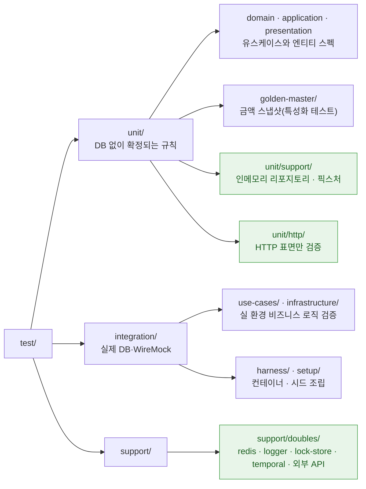
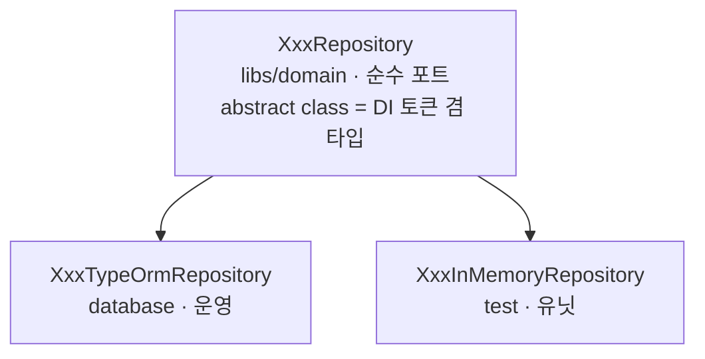
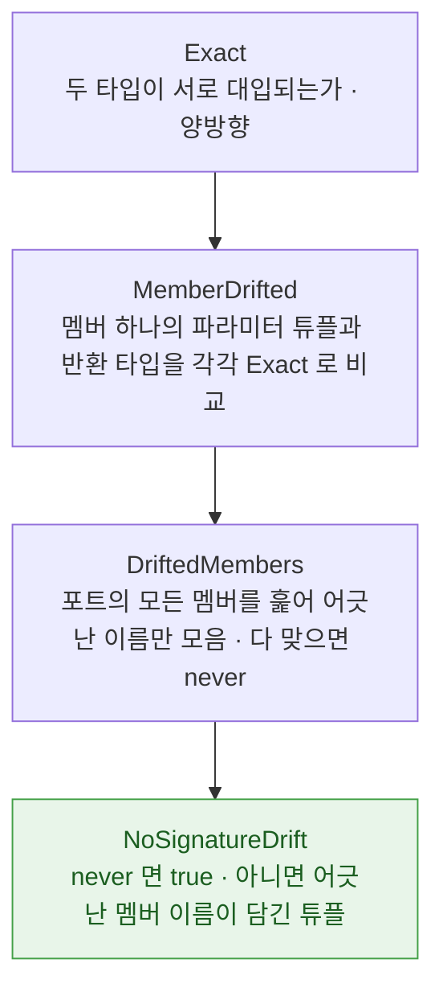

이전 글에서는 Mock이 2,199개까지 늘어났던 이유와 이를 해결하기 위해 Testcontainers·WireMock으로 통합 테스트 환경을 만들고 특성화 테스트로 안전망을 친 과정을 정리했습니다.

이번 글에서는 이 발판 위에서 **사람과 AI 모두 다시는 Mock으로 돌아가지 못하도록 시스템과 아키텍처를 개편한 과정**을 공유합니다.

## 시스템으로 강제하기

리포지토리와 도메인 서비스를 대신하던 Mock을 전량 걷어내면서, 같은 일이 반복되지 않도록 규칙을 커스텀 eslint 룰로 만들었습니다. 컨벤션 문서는 지켜지지 않으면, Lint에서 머지가 안됩니다.

```jsx
// eslint-rules.js — 본문 외 부분은 생략했습니다.
const MOCK_APIS = new Set(['fn', 'mock', 'doMock', 'hoisted', 'spyOn', 'mocked']);
// Mock을 정의해도 되는 자리.
const DEFAULT_MOCK_ALLOWED_DIRS = ['/test/support/doubles/', '/test/unit/support/', '/test/unit/http/'];
const noInternalCollaboratorMock = {
  meta: {
    // …
    messages: {
      forbidden:
        "spec 에서 'vi.{{api}}' 로 리포지토리·도메인 서비스를 Mock으로 세우지 않는다. 저장된 값을 봐야 하면 통합 테스트로 내리고, " +
        "계산 결과만 보면 in-memory fake 를 쓴다. 외부 경계(HTTP·Redis·S3·Temporal)의 대역이라면 " +
        "{{dirs}} 의 공용 함수로 만들어 쓴다.",
    },
  },
  create(context) {
    if (!context.filename.endsWith('.spec.ts')) return {};              // spec 만 본다
    if (allowedDirs.some((dir) => normalized.includes(dir))) return {}; // 화이트리스트는 통과
    return {
      'CallExpression > MemberExpression[object.name="vi"]'(node) {     // vi.* 를 잡아
        if (!MOCK_APIS.has(api)) return;                                // Mock API 만 걸러낸다
        context.report({ node, messageId: 'forbidden', data: { api, dirs } });
      },
    };
  },
};
```

에러 메시지에 '무엇을 하지 마라'가 아니라 **대신 '무엇을 하라'**를 넣었습니다. 사람보다 에이전트에게 더 중요한 규칙입니다. 규칙에 걸린 다음 행동이 메시지 안에 있으면, 에이전트는 Mock을 하나 더 세우는 대신 통합 테스트로 내려갑니다.

막는 것만큼 중요한 건 예외를 좁히는 일이었습니다. 화이트리스트에 적힌 세 경로가 무엇인지 보면 규칙의 모양이 드러납니다.



초록으로 칠한 세 곳이 Mock을 세워도 되는 자리입니다. `support/doubles/`는 프로세스 밖 경계, `unit/support/`는 포트를 상속한 인메모리 구현과 픽스처, `unit/http/`는 HTTP 표면 자체를 보는 자리입니다.

**통합 테스트 디렉터리는 화이트리스트에 없습니다.** 실물을 그대로 조립하는 곳이라 Mock이 필요할 이유가 없습니다.

## `as never` 없이 진짜 객체로 갈아끼우기

lint로 Mock을 막았으면 대신 쓸 것을 줘야 합니다. 그런데 그 자리에 넣을 수 있는 게 없었습니다.

리포지토리는 전부 `BaseRepository`를 상속하고 있었습니다.

```tsx
// src/database/base.repository.ts
export abstract class BaseRepository<Entity extends ObjectLiteral> {
  protected constructor(protected readonly repository: Repository<Entity>) {}
  protected withManager(manager?: EntityManager): Repository<Entity> { … }
  private withUpdateDate(partialEntity: QueryDeepPartialEntity<Entity>) { … }
  // …
}
```

`protected` 와 `private` 이 문제입니다. TypeScript 는 구조적 타이핑을 쓰지만 **비공개 멤버만은 명목적으로 비교합니다.** 모양이 아무리 같아도 같은 클래스 선언에서 상속받은 게 아니면 호환되지 않습니다. 스펙에서 `{ findByCode: async () => … }` 처럼 필요한 메서드만 담은 객체를 만들어도, 리포지토리 자리에는 애초에 들어가지 않습니다. 남은 길은 `as never` 캐스팅뿐이었습니다.

캐스팅한 자리는 컴파일러가 더 이상 검사하지 않습니다. `as never` 는 어떤 타입에도 대입되므로 무엇을 넣어도 통과하고, 돌려주는 모양이 실제 엔티티와 갈라져도 컴파일 단계에서 알 방법이 없습니다.

편해서 Mock을 썼던 게 아니라 **타입이 안전한 대역을 만들 방법 자체가 없었던 겁니다.** 그 방법을 만들기 위해 아래 네 가지를 순서대로 작업했습니다.

### ① 컨트롤러에서 UseCase 분리하기

컨트롤러가 서비스를 직접 주입하고, 그 서비스는 비대했습니다. 검증하고 싶은 단위가 코드에 없으니 테스트는 서비스 전체를 세워야 했고, 그러려면 그 서비스가 건드리는 걸 전부 Mock으로 막아야 했습니다.

컨트롤러는 DTO(Data Transfer Object) 검증과 인증 컨텍스트 추출만 하고 UseCase를 부르도록 정리했습니다. 이제 검증할 단위가 코드에 있습니다.

앞에서 본 `InternalBrandsService`가 그랬습니다. 276줄 안에 목록·상세·수정이 다 들어 있었고, 생성자는 세 기능이 쓰는 것을 다 합쳐 7개를 받았습니다.

```tsx
// Before — 한 클래스가 세 기능을 다 갖는다.
export class InternalBrandsService {
  constructor(
    brandRepository, brandProductRepository, userLinkRepository, settlementRepository,
    categoryRepository, feeResolverService, platformFeeService,
  ) {}
  public async listBrands(…)    // 목록
  public async getDetail(…)     // 상세
  public async updateDetail(…)  // 수정
}
// After — 기능마다 클래스 하나. 자기가 쓰는 것만 받는다.
export class ListInternalBrandsUseCase {      // 브랜드 목록 UseCase
  constructor(brandRepository, brandProductRepository, userLinkRepository,
              orderItemRepository, settlementRepository, categoryRepository, feeResolverService) {}
  public async execute(query: InternalBrandListQueryDto) { … }
}
export class GetInternalBrandDetailUseCase {  // 브랜드 상세 UseCase
  constructor(brandRepository, brandProductRepository, userLinkRepository,
              orderItemRepository, settlementRepository, feeResolverService) {}
  public async execute(brandCode: string) { … }
}
export class UpdateInternalBrandUseCase {     // 브랜드 수정 UseCase
  constructor(brandRepository, platformFeeService) {}
  public async execute(brandCode: string, payload: InternalBrandUpdateRequestDto) { … }
}
```

브랜드 수정 테스트가 채워야 할 자리가 **7개에서 2개로** 줄었습니다. 앞에서 본 `{} as never` 다섯 줄이 통째로 사라진 겁니다. 목록이 여전히 7개인 건 목록이 진짜로 일곱을 쓰기 때문이고요. 핵심은 줄어든 개수가 아니라 **각자 쓰는 것만 받게 됐다**는 점입니다.

### ② 쿼리 조건을 리포지토리 안으로 옮기기

기존 리포지토리를 쓰는 서비스 코드는 아래 코드 같은 방식이었습니다.

```tsx
// Before — 조건이 호출부에 있다.
const deals = await this.userLinkRepository.findBy({ userLinkCode: In(userDealCodes) });
const brand = await this.brandRepository.findOne({
  where: { brandCode: context.brandCode, deleteDate: IsNull() },
  select: { brandName: true, siteUrl: true },
});
```

`findBy` 와 `findOne` 은 `BaseRepository` 가 물려준 TypeORM 메서드입니다. 조건이 호출부에 있으니 리포지토리에는 남는 게 없습니다. 세 앱 중 한 곳이 특히 그랬는데, 리포지토리 23개 중 21개가 생성자만 있고 자기 메서드는 하나도 없는 껍데기였습니다.

그러면 호출부가 기대는 것이 "브랜드를 코드로 찾는다"가 아니라 **"`findOne` 에 이런 조건 객체를 넘긴다"**가 됩니다. 그 자리를 대신하려면 TypeORM 을 흉내 내야 합니다.

```tsx
// After — 조건이 리포지토리 안으로 들어가고, 밖에는 이름만 남는다.
const deals = await this.userLinkRepository.findByLinkCodes(userDealCodes);
const brand = await this.brandRepository.findActiveNameAndSite(context.brandCode);
```

이런 인라인 쿼리가 그 앱 한 곳에서만 112곳 나왔습니다. 이걸 이름 있는 메서드 64개로 옮기고, 두 베이스 클래스(`BaseRepository`·`MasterReadBaseRepository`)의 쿼리 메서드 42개는 `protected` 로 내려 밖에서 못 부르게 했습니다. 옮긴 자리에서는 `In`·`IsNull` 같은 TypeORM import 도 호출부에서 사라졌습니다. 조건 객체를 그대로 넘겨야 하는 몇 곳은 예외로 남겼습니다.

여기서 규칙을 하나 세웠습니다. **옮기기만 하고, 고치지는 않는다.** 당시 커밋 메시지에 이렇게 적었습니다.

> 이 작업은 타입체크가 의미를 검증해주지 않고(조건을 잘못 옮겨도 컴파일된다), 인라인 쿼리가 있는 파일 중 21%만 통합 테스트로 덮여 있다. 그래서 조건식·SQL 문자열·별칭·파라미터명·체인 순서를 한 글자도 바꾸지 않고 이름만 붙였다.
>

합치고 싶은 것, 정리하고 싶은 것은 전부 후속으로 남겼습니다. 테스트가 얇은 구간에서는 고치기와 옮기기를 같은 커밋에 넣지 않는 편이 안전했습니다.

이름만 바꾸면 그 코드를 검증하던 Mock 스펙은 전부 실패합니다. Mock이 흉내 내던 메서드가 사라졌으니까요. 주문 생성 쪽은 기존 스펙이 1,469줄이라 다시 쓰는 대신 **옛 표면을 되살리는 어댑터를 스펙 안에 만들었습니다.**

```tsx
// 스펙이 이미 갖고 있던 옛 Mock은 findBy·existsBy 를 가진 객체다.
// 유스케이스는 이제 findByLinkCodes·existsByExternalOrderCode·persist 를 요구한다.
// 그 사이를 잇는 객체를 스펙 안에서 만들어 넘긴다. 기존 시나리오(호출 순서·mockResolvedValueOnce 체인)는 그대로 둔 채.
const createUseCase = (
  manager: ManagerMock,
  userLinkRepository: { findBy: Mock },
  orderRepository: { existsBy: Mock; create: Mock },
  /* … 지면상 쓰이는 것만 남겼습니다 */
) =>
  new CreateOmsOrderUseCase(
    // …
    { findByLinkCodes: (codes) => userLinkRepository.findBy({ userLinkCode: codes }) } as never,
    // …
    {
      existsByExternalOrderCode: (code) => orderRepository.existsBy({ externalOrderCode: code }),
      create: orderRepository.create,
      persist: (order) => manager.getRepository().save(order),   // ← 리포지토리가 가져간 저장 책임을 manager 로 되돌린다
    } as never,
    // …
  );
```

이 어댑터도 결국 `as never` 캐스팅이라 컴파일러가 검사해 주지 않습니다. 통합 테스트가 1,469줄을 대신할 때까지만 버티면 되는 자리라 그대로 두고, 통합 테스트 적용 후 코드를 제거했습니다.

### ③ 트랜잭션을 인자로 넘기지 않기

리포지토리에 메서드를 만들고 나니, 트랜잭션이 필요한 메서드에는 파라미터가 하나씩 더 달려 있었습니다.

```tsx
await this.orderRepository.persist(order, entityManager);
await this.orderGroupRepository.persistMany(orderGroups, entityManager);
```

`EntityManager` 를 호출부에서 리포지토리로 계속 넘기고 있었던 겁니다. 이게 파라미터로 남아 있으면 인메모리 구현도 `EntityManager` 를 흉내 내야 하는데, 그건 불가능합니다. 다시 캐스팅으로 돌아가죠.

그래서 `AsyncLocalStorage`(이하 ALS)로 트랜잭션 컨텍스트를 만들고, `BaseRepository` 가 진행 중인 트랜잭션에 알아서 합류하게 했습니다.

```tsx
// src/database/transaction-runner.ts — 트랜잭션을 열면서 그 manager 를 컨텍스트에 담는다.
public run<T>(work: (manager: EntityManager) => Promise<T>): Promise<T> {
  return this.dataSource.transaction((manager) => runInTransactionContext(manager, () => work(manager)));
}
// src/database/base.repository.ts — 컨텍스트에 트랜잭션이 있으면 그쪽 repository 를 쓴다.
protected get repository(): Repository<Entity> {
  const ambient = currentTransactionManager();
  return ambient ? ambient.getRepository<Entity>(this.rawRepository.target) : this.rawRepository;
}
```

호출부는 이제 `persist(order)` 만 부르면 됩니다. 트랜잭션 안이면 그 트랜잭션에, 밖이면 기본 커넥션에 붙습니다. 인자로 넘기던 `manager` 는 전부 걷어냈습니다.

```tsx
// 회원 생성·예약 소비·SNS 저장을 한 트랜잭션으로 묶는다. 세 리포지토리 어디에도 manager 를 넘기는 자리가 없다.
await this.transactionRunner.run(async () => {
  await this.userRepository.persist(entity);
  await this.pendingCreatorRepository.persist(reservedCreator);
  await this.userSnsRepository.saveInstagram(userCode, instagramUrl);
});
```

대신 `run()` 안에서 하는 일은 전부 await 합니다. 알림이나 웹훅처럼 await 없이 던져 두는 작업이 안에 있으면, 트랜잭션이 끝나고 커넥션이 반납된 뒤에 실행돼 이미 반납된 커넥션으로 쿼리가 나갈 수 있습니다. 그런 것들은 `run()` 밖에 처리합니다.

결과적으로 리포지토리 시그니처에서 `EntityManager`를 완전히 제거할 수 있었습니다.

### ④ 리포지토리를 인터페이스로 분리하기

세 애플리케이션을 하나로 합치면서 리포지토리를 포트(Port)와 어댑터(Adapter) 구조로 바꿨습니다. 호출부는 포트에만 의존하고, 어댑터는 자기가 쓰는 기술 스택을 클래스명에 드러내도록 했습니다.



포트를 `interface` 대신 `abstract class`로 정의한 데는 이유가 있습니다.
TypeScript의 `interface`는 Spring과 달리 빌드 시 런타임에서 사라져 NestJS의 의존성 주입(DI) 토큰으로 쓸 수 없기 때문입니다.
`abstract class`는 런타임에도 클래스로 남아 **DI 토큰이자 타입으로 함께 쓸 수 있습니다.** 게다가 모든 메서드가 추상(`public abstract`) 형태로 선언되어 있어, 이를 상속(`extends`)받거나 구현(`implements`)하는 어댑터로 언제든 교체할 수 있습니다.

덕분에 이 리포지토리를 가져다 쓰는 쪽에서는 `BrandRepository`라는 포트 하나만 알면 됩니다. 그 자리에 운영용 TypeORM 어댑터가 꽂혀 있는지, 테스트용 인메모리 어댑터가 꽂혀 있는지는 알 필요가 없죠.

`BrandRepository`가 그렇습니다. **테스트 환경에서** Mock을 걷어낸 자리는, 코드 맨 아래에 있는 '포트를 상속받은 인메모리 어댑터'가 채웁니다.

```tsx
// libs/domain/brand/brand.repository.ts — 포트. TypeORM에 대한 의존성이 전혀 없다.
export abstract class BrandRepository {
  abstract findOneByCode(brandCode: string): Promise<BrandEntity | null>;
  abstract findActiveNameAndSite(brandCode: string): Promise<BrandEntity | null>;
  abstract persist(brand: BrandEntity): Promise<BrandEntity>;
  // …
}
```

**운영 환경**에서는 이 인터페이스를 TypeORM 으로 구현해 동작합니다.

```tsx
// database/repositories/brand.repository.ts — TypeORM 어댑터 (운영 환경)
@Injectable()
export class BrandTypeOrmRepository extends BaseRepository<BrandEntity> implements BrandRepository {
  public findActiveNameAndSite(brandCode: string): Promise<BrandEntity | null> {
    return this.repository.findOne({
      where: { brandCode, deleteDate: IsNull() },
      select: { brandName: true, siteUrl: true },
    });
  }
  // …
}
```

**테스트 환경**에서는 기존 Mock 대신 포트를 상속받은 인메모리 구현체로 동작합니다.

```tsx
// test/unit/support/brand-in-memory.repository.ts — 인메모리 어댑터 (유닛 테스트 환경)
export class BrandInMemoryRepository extends BrandRepository {
  private readonly brands: BrandEntity[] = [];
  seed(...brands: BrandEntity[]): this {
    this.brands.push(...brands);
    return this;
  }
  /** 저장된 상태를 직관적으로 확인한다. "무엇이 저장되었는가"를 단언(assert)할 때 활용한다. */
  get saved(): readonly BrandEntity[] {
    return this.brands;
  }
  async save(brand: BrandEntity): Promise<BrandEntity> { … }
  /** 이 스펙에서는 브랜드 이름과 사이트를 다루지 않으므로 호출 시 예외를 던진다. */
  findActiveNameAndSite(): Promise<BrandEntity | null> {
    return notUsed('findActiveNameAndSite');
  }
}
```

코드 어디에도 `as never`나 `as unknown as` 같은 강제 타입 캐스팅이 없습니다. 오직 `extends` 하나로 처리됩니다. 이전 방식보다 타입이 더 안전합니다. 포트 스펙이 바뀌면 이 인메모리 파일에서 바로 컴파일 에러가 나기 때문입니다. 적어도 이 시점까지는 안전하다고 봤습니다.

테스트 픽스처를 작성하며 규칙 두 가지를 더 정했습니다.

**1. 테스트 데이터는 객체 리터럴이 아닌 '실물 엔티티'로 주입한다.**

엔티티는 비즈니스 로직(메서드)을 품고 있는 도메인 모델이라, 단순 객체로 때우려 하면 타입 에러가 납니다. 이를 피하려고 Mock에 로직을 어설프게 다시 구현하면 운영 코드와 결과가 달라질 위험도 생기죠.

**진짜 엔티티**를 써야 안전합니다. 그래서 테스트에 필요한 필드만 받아 진짜 엔티티를 조립해 주는 빌더 함수를 만들었습니다.

```tsx
/** 테스트에 필요한 최소 필드만 전달받아 실물 엔티티를 생성한다. 전달받지 않은 항목은 기본값으로 채워진다. */
export function aBrandEntity(overrides: Partial<BrandEntity> & Pick<BrandEntity, 'brandCode' | 'brandName'>): BrandEntity {
  return Object.assign(new BrandEntity(), overrides);
}
```

**2. 안 쓰는 메서드는 빈 구현 대신 예외를 던진다.**

테스트용 인메모리 어댑터에 포트의 모든 메서드를 다 구현하려 들면, **테스트 코드가 또 하나의 운영 코드**가 되어버립니다. 그래서 그 테스트에서 안 쓰는 메서드가 호출되면 바로 예외를 터뜨리도록 만들었습니다.

```tsx
function notUsed(method: string): never {
  throw new Error(`BrandInMemoryRepository.${method}: 이 테스트에서 쓰지 않는 메서드입니다.`);
}
```

이 예외는 단순한 에러 메시지가 아니라 **설계가 보내는 경고 신호**입니다. 이 에러가 터졌다는 건, 그 테스트가 여태 안 쓰던 메서드를 건드리기 시작했다는 뜻이죠. 이때 개발자는 다음 둘 중 하나를 선택해야 합니다.

1. **인메모리로 충분한 경우:** DB 없이도 로직을 다 검증할 수 있는 규칙이라면, 인메모리 어댑터에 해당 구현을 추가해서 단위 테스트(Unit Test)로 유지합니다.
2. **DB 동작이 핵심인 경우:** 저장이나 조회 결과가 실제 DB의 특성에 의존해야 한다면, 이 테스트는 단위 테스트의 범위를 벗어난 것이므로 **통합 테스트(Integration Test)로 넘깁니다.**

여기서 가장 경계해야 할 행동은, 귀찮다고 **`[]`(빈 배열)이나 `null`을 슬쩍 반환해 버리는 것**입니다. 그렇게 하면 우리가 지우려던 **가짜 객체(Mock)가 이름만 바꾼 채 다시 돌아옵니다.**

## **타입 시스템이 허용한 침묵**

인메모리 구현체가 포트 클래스를 `extends`하고 있으니 안전할 거라 믿었습니다. 하지만 **TypeScript는 메서드 구현체가 선언부의 매개변수를 무시(생략)하는 것을 허용**합니다. JavaScript 시절 콜백 함수의 관례를 지키기 위해 만들어진, 켜거나 끌 수도 없는 TS 본연의 동작 규칙 때문입니다.

예를 들어, 리포지토리 포트에 "삭제된 행 포함 여부"를 판단하는 옵션 파라미터를 하나 추가했다고 가정해 보겠습니다.

```tsx
abstract class OrderItemFeeRepository {
  abstract findByIds(ids: number[], includeDeleted?: boolean): Promise<Fee[]>;
}
// 인메모리 구현은 그대로 둡니다. 두 번째 인자를 아예 안 받습니다.
class OrderItemFeeInMemoryRepository extends OrderItemFeeRepository {
  override async findByIds(ids: number[]): Promise<Fee[]> {
    return this.fees.filter((fee) => ids.includes(fee.id));
  }
}
```

**이 코드는 컴파일을 통과합니다.**

실제 DB를 쓰는 운영 구현체는 `includeDeleted`를 체크해 삭제된 행을 제대로 걸러내지만, 인메모리 구현체는 이런 파라미터가 있는지도 모른 채 삭제된 행까지 전부 돌려줍니다. 단위 테스트는 여전히 초록불을 켜며 통과하고, 이 오작동은 운영에 나가서야 드러납니다. Mock을 걷어내며 없애려 했던 '거짓 안전감'과 '침묵'이 그대로 되살아났습니다.

## **타입 시스템으로 컴파일 타임에 감지**

메서드의 파라미터 튜플과 반환 타입을 **양방향으로 엄격하게 비교**해서, 컴파일 타임에 잡도록 만들었습니다.



```tsx
/** 양방향 대입 가능성. 한쪽으로만 대입되는 관계는 false. */
type Exact<A, B> = [A] extends [B] ? ([B] extends [A] ? true : false) : false;
/** 포트의 멤버를 훑어 파라미터·반환 타입이 어긋난 멤버의 이름만 모은다. 다 맞으면 never. */
type DriftedMembers<Impl extends Port, Port> = { /* … */ }[keyof Port];
/** 어긋난 게 없으면 true, 있으면 그 이름이 박힐 튜플이 된다. */
type NoSignatureDrift<Impl extends Port, Port> = [DriftedMembers<Impl, Port>] extends [never]
  ? true
  : ['포트와 시그니처가 어긋난 멤버', DriftedMembers<Impl, Port>];
```

위 흐름에서 초록색으로 표시된 `NoSignatureDrift` 하나만 실제 인메모리 파일 하단에 선언해 두면 됩니다.

```tsx
const _noSignatureDrift: NoSignatureDrift<OrderItemFeeInMemoryRepository, OrderItemFeeRepository> = true;
// error TS2322: Type 'boolean' is not assignable to type
//               '["포트와 시그니처가 어긋난 멤버", "findByIds"]'.
```

`[number[]]`와 `[number[], boolean?]`은 단방향 대입만 가능하므로 이 타입 검사에서 바로 걸러집니다. 하나라도 어긋나는 순간 타입 결과가 `true`에서 튜플로 바뀌며 컴파일 에러가 납니다.

개발자가 원인을 바로 알 수 있도록 단순 `boolean`이 아닌 **에러 메시지 역할을 할 튜플**을 반환하게 했습니다. 그래서 포트의 시그니처가 바뀌는 즉시 인메모리 구현체가 컴파일 에러를 뿜으며 안전하게 깨집니다.

## **Mock을 지운 자리에 무엇을 채울 것인가**

Mock을 지운 자리에 불완전한 검증을 채우면 Mock은 다른 형태로 되살아날 뿐입니다. 그래서 DB에 기대지 않고 로직만으로 확정되는 규칙만 단위 테스트 대상으로 골랐습니다. 이 대상도 전수로 조사해 추렸습니다.

**대표적인 검증 대상은 도메인 엔티티입니다.**

스스로 상태와 행위를 지닌 엔티티는 단순한 데이터 객체가 아니라 도메인 규칙 그 자체입니다. 3개 애플리케이션을 조사해 보니, 상태와 행위를 가진 엔티티 29개 중 전용 단위 테스트가 있는 건 4개뿐이었습니다. 나머지는 통합 테스트가 도는 과정에서 우회로 덮고 있었습니다. 상태 전이, 경계값 검증, 불변식은 DB 연결 없이 확정할 수 있으니 모두 단위 테스트로 옮겼습니다.

**요청·응답 DTO 검증도 손봤습니다.**

그렇게 판단한 근거는 커밋 히스토리에 있었습니다.

> `@Expose` 누락 시 `excludeExtraneousValues` 설정으로 인해 필드가 유실되는 현상이 발생합니다. 이는 TypeScript 타입 체커를 통과하며 API 응답 역시 200 OK로 반환되므로 쉽게 감지되지 않습니다. 최근 3개월간 동일 패턴의 이슈가 5회 발생했고, 매번 회귀 테스트가 추가되는 상황이었습니다.
>

테스트가 있는 DTO는 **장애가 났던 지점일 뿐**이었습니다. 같은 구조인데 테스트가 없는 곳이 여럿이었습니다.

사고가 난 지점에만 붙는 테스트는 검증 체계가 아니라 **사고 기록**에 가깝습니다. 같은 약점을 가진 곳을 미리 찾아 테스트를 붙여 두는 게 진짜 예방입니다.

## 2,199개에서 4개로 줄어든 Mock

| **구 분** | **개편 전 (05/08)** | **개편 중 (06/30)** | **개편 후 (07/27)** |
| --- | --- | --- | --- |
| **`vi.fn()` 호출 횟수** | 약 1,336개 | 약 2,199개 | **4개** |
| **통합 테스트 파일** | 0개 | 35개 | **143개** |
| **리포지토리 형태의 Mock** | — | 73개 | **0개** |

그렇다면 왜 4개가 남아있을까요?

남아 있는 4개는 전부 `test/unit/http/` 아래 테스트 파일 두 곳에만 있습니다. 라우팅, Guard, ValidationPipe, 예외 필터, 직렬화처럼 **HTTP 전달 레이어의 동작만 검증하는 자리**라, 그 뒤에 있는 비즈니스 로직(유스케이스)은 Mock으로 세워 두는 게 구조상 맞기 때문입니다.

## 남아있는 건 '어기면 에러 나는 규칙'

두 달 반 동안 규칙을 많이 만들었는데, 끝까지 지켜지는 건 **Lint 룰, 타입 제약, CI 게이트**처럼 어겼을 때 바로 에러가 터지는 것들뿐이었습니다. 문서에 아무리 정성껏 써두어도 **종종 놓치거나 건너뛰곤 하더라고요.** `AGENTS.md` 파일도 이제는 실제 에러를 내주는 룰들을 가리키는 링크만 남아있습니다. 에이전트는 글자로 적힌 문서보다 당장 눈앞에 있는 코드 파일을 더 잘 믿고, 사실 사람도 다를 게 없으니까요.

여기까지 무사히 올 수 있었던 핵심은 딱 두 가지였습니다.

#### 1. 일하는 순서를 지키기

통합 테스트라는 기본 안전망도 없이 Mock부터 지웠다면, 검증 자체가 날아갔을 겁니다. 기존 동작을 묶어주는 테스트(특성화 테스트) 없이 결제 금액 로직을 건드렸다면 어디가 터졌는지조차 몰랐겠죠. Lint 에러가 수두룩한 상태에서 새 규칙을 추가해 봤자 아무것도 못 막았을 거고요. **순서를 하나씩 지켰기 때문에 앞 단계가 다음 단계의 탄탄한 발판이 되어주었습니다.**

#### 2. 테스트 신뢰도 높이기

테스트가 에러 없이 통과하는 것과 진짜 로직을 잘 검증하고 있는 건 완전히 별개였습니다. 이번에 터진 가장 치명적인 버그들은 테스트가 실패했을 때가 아니라, **아이러니하게도 '아무 문제 없이 통과하던 테스트' 뒤에 숨어 있었습니다.** Mock이 대충 만들어낸 통과, `as never`로 타입을 강제로 넘겨서 얻은 통과, 일단 인터페이스만 맞춰두고 빈껍데기로 둔 인메모리 구현체가 만든 통과였죠.

## 마치며

돌아보면 Mock을 지우는 과정은 단순히 걷어내는 작업이 아니었습니다. **진짜 검증이 동작하는 환경을 만들고, 실수하고 싶어도 실수할 수 없는 구조를 세우는 일**이었습니다.

사람도 AI 에이전트도 편리함 앞에서는 쉽게 관성에 끌려갑니다. 자연어로 적힌 지시사항이나 컨벤션 문서로 의지를 다지는 데는 한계가 있었습니다. 시스템과 컴파일러가 직접 에러를 터뜨려 주니까 코드베이스 품질이 계속 지켜졌습니다.

비슷하게 Mock으로 덮인 코드베이스나 AI 에이전트의 관성 때문에 고민하고 계신 분들에게, 이 기록이 작게나마 도움이 되었기를 바랍니다.
